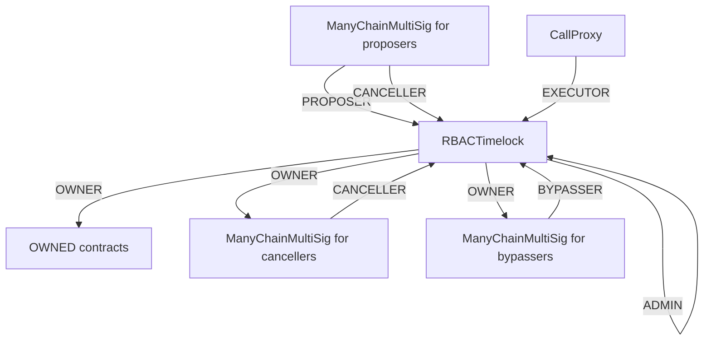
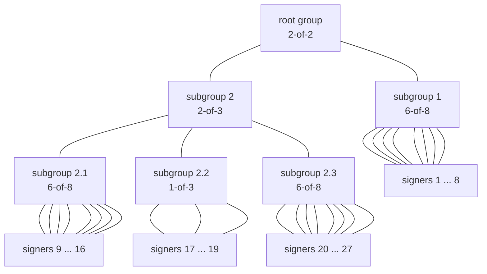
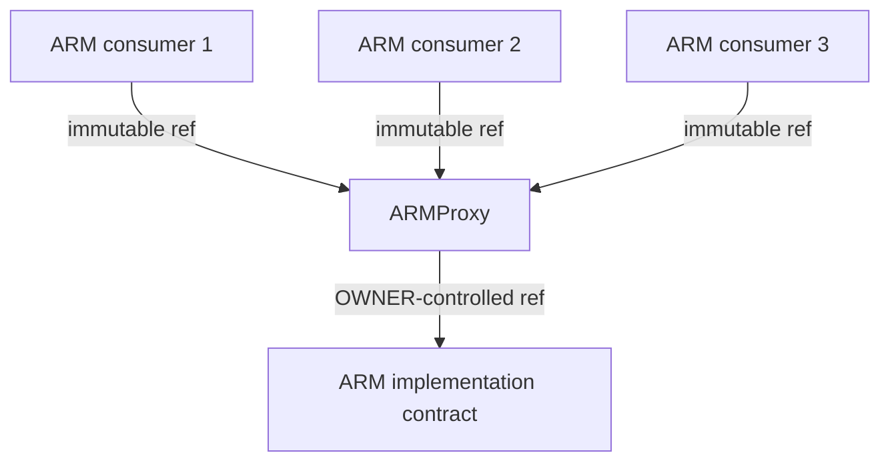

# ✨ So you want to run an audit

This `README.md` contains a set of checklists for our audit collaboration.

Your audit will use two repos:
- **an _audit_ repo** (this one), which is used for scoping your audit and for providing information to wardens
- **a _findings_ repo**, where issues are submitted (shared with you after the audit)

Ultimately, when we launch the audit, this repo will be made public and will contain the smart contracts to be reviewed and all the information needed for audit participants. The findings repo will be made public after the audit report is published and your team has mitigated the identified issues.

Some of the checklists in this doc are for **C4 (🐺)** and some of them are for **you as the audit sponsor (⭐️)**.

---
# Repo setup

## ⭐️ Sponsor: Add code to this repo

- [ ] Create a PR to this repo with the below changes:
- [ ] Provide a self-contained repository with working commands that will build (at least) all in-scope contracts, and commands that will run tests producing gas reports for the relevant contracts.
- [ ] Make sure your code is thoroughly commented using the [NatSpec format](https://docs.soliditylang.org/en/v0.5.10/natspec-format.html#natspec-format).
- [ ] Please have final versions of contracts and documentation added/updated in this repo **no less than 24 hours prior to audit start time.**
- [ ] Be prepared for a 🚨code freeze🚨 for the duration of the audit — important because it establishes a level playing field. We want to ensure everyone's looking at the same code, no matter when they look during the audit. (Note: this includes your own repo, since a PR can leak alpha to our wardens!)


---

## ⭐️ Sponsor: Edit this README

Under "SPONSORS ADD INFO HERE" heading below, include the following:

- [ ] Modify the bottom of this `README.md` file to describe how your code is supposed to work with links to any relevent documentation and any other criteria/details that the C4 Wardens should keep in mind when reviewing. ([Here's a well-constructed example.](https://github.com/code-423n4/2022-08-foundation#readme))
  - [ ] When linking, please provide all links as full absolute links versus relative links
  - [ ] All information should be provided in markdown format (HTML does not render on Code4rena.com)
- [ ] Under the "Scope" heading, provide the name of each contract and:
  - [ ] source lines of code (excluding blank lines and comments) in each
  - [ ] external contracts called in each
  - [ ] libraries used in each
- [ ] Describe any novel or unique curve logic or mathematical models implemented in the contracts
- [ ] Does the token conform to the ERC-20 standard? In what specific ways does it differ?
- [ ] Describe anything else that adds any special logic that makes your approach unique
- [ ] Identify any areas of specific concern in reviewing the code
- [ ] Review the Gas award pool amount. This can be adjusted up or down, based on your preference - just flag it for Code4rena staff so we can update the pool totals across all comms channels.
- [ ] Optional / nice to have: pre-record a high-level overview of your protocol (not just specific smart contract functions). This saves wardens a lot of time wading through documentation.
- [ ] See also: [this checklist in Notion](https://code4rena.notion.site/Key-info-for-Code4rena-sponsors-f60764c4c4574bbf8e7a6dbd72cc49b4#0cafa01e6201462e9f78677a39e09746)
- [ ] Delete this checklist and all text above the line below when you're ready.

---

# Chainlink CCIP-2 audit details
- Total Prize Pool: $47,900 USDC
  - HM awards: $24,750 USDC
  - Analysis awards: $1,500 USDC
  - QA awards: $750 USDC
  - Bot Race awards: $2,250 USDC
  - Gas awards: $0 USDC
  - Judge awards: $5,000 USDC
  - Lookout awards: $2,400 USDC
  - Scout awards: $500 USDC
  - Mitigation Review: $10,000 USDC (*Opportunity goes to top 3 certified wardens based on placement in this audit.*)
- Join [C4 Discord](https://discord.gg/code4rena) to register
- Submit findings [using the C4 form](https://code4rena.com/contests/2023-07-chainlink/submit)
- [Read our guidelines for more details](https://docs.code4rena.com/roles/wardens)
- Starts July 05, 2023 20:00 UTC
- Ends July 12, 2023 20:00 UTC

**IMPORTANT NOTE:** Prior to receiving payment from this audit you MUST become a [Certified Warden](https://code4rena.com/certified-contributor-application/)  (successfully complete KYC). This also applies to bot crews.  You do not have to complete this process before competing or submitting bugs. You must have started this process within 48 hours after the audit ends, i.e. **by July 12, 2023 at 20:00 UTC in order to receive payment.**

## Automated Findings / Publicly Known Issues

Automated findings output for the audit can be found [here](add link to report) within 24 hours of audit opening.

*Note for C4 wardens: Anything included in the automated findings output is considered a publicly known issue and is ineligible for awards.*

[ ⭐️ SPONSORS ADD INFO HERE ]

# Overview

## `CallProxy`, `ManyChainMultiSig`, `RBACTimelock`
The `CallProxy`, `ManyChainMultiSig`, `RBACTimelock` contracts are all part of a system of `owner` contracts that is supposed to administer other contracts (henceforth referred to as `OWNED`). `OWNED` contracts represent any system of contracts that are (1) potentially deployed across chains and (2) have an `owner` role (e.g. using OpenZeppelin's `OwnableInterface`).

Here is a diagram of how we envision these contracts to be configured:



Regular administration of the `OWNED` contracts is expected to happen through
the `RBACTimelock`'s Proposer/Executor/Canceller roles. The Bypasser role is
expected to only become active in "break-glass" type emergency scenarios where
waiting for `RBACTimelock.minDelay` would be harmful.

We expect to set `RBACTimelock.minDelay` to ~ 24 hours in our deployment.
This enables anyone to inspect configuration changes to the OWNED contracts before
they take effect. For example, a user that disagrees with a configuration change might choose
to withdraw funds stored in OWNED contracts before they can be executed. (Though the exact mechanism and assumptions around how this would work are out of scope.)

We may use `RBACTimelock.blockFunctionSelector` to prevent specific functions on the
`OWNED` contracts from being called through the regular propose-execute flow.

Proposers can also cancel so that they may "undo" proposals with mistakes in them.

The `CallProxy` is intentionally callable by anyone. Offchain tooling used for
generating configuration changes will make appropriate use of the `RBACTimelock`'s
support for `predecessor`s to ensure that configuration changes are sequenced properly
even if an adversary is executing them. Since the adversary can also control the amount
of gas, configuration functions are expected to not have gas-dependent behavior other than reverting of insufficient gas is supplied.

The `CallProxy` is not expected to be used with contracts that could `SELFDESTRUCT`. It thus has no
`EXTCODESIZE`-check prior to making a call, we expect it to be configured correctly (i.e. pointing to a real `RBACTimelock`) on deployment.

Unlike standard multi-sig contracts, `ManyChainMultiSig` supports signing many transactions
targeting many chains with a single set of signatures. (We currently only target EVM chains
and all EVM chains support the same ECDSA secp256k1 standard.) This is useful for administering
systems of contracts spanning many chains without increasing signing overhead linearly with the
number of supported chains. We expect to use the same set of EOA signers across many chains.Consequently, `ManyChainMultiSig` only supports EOAs as signers, *not* other smart contracts.
Similar to the rest of the system, *anyone* who can furnish a correct Merkle proof is allowed to execute authorized calls on the `ManyChainMultiSig`, including a potential adversary. The
adversary will be able to control the gas price and amount for the execution.

The Proposer and Canceller `ManyChainMultiSig` contracts are expected to be
configured with a group structure like this, with different sets of signers for each
(exact k-of-n parameters might differ):
```
          ┌──────────┐
          │Root Group│
      ┌──►│  6-of-8  │◄─────────┐
      │   └──────────┘          │
      │         ▲               │
      │         │               │
 ┌────┴───┐ ┌───┴────┐     ┌────┴───┐
 │signer 1│ │signer 2│ ... │signer 8│
 └────────┘ └────────┘     └────────┘
```

The Bypasser `ManyChainMultiSig` contract is expected to be configured with a
more complex group structure like this (exact structure might differ):


Subgroup 2.1 has the same signers as the canceller `ManyChainMultiSig`. No change can ever be enacted
without approval of this group.

## `ARMProxy`

The `ARMProxy` enables an `owner` (using `RBACTimelock`) to upgrade an underlying
`ARM` contract. When the `owner` wants to upgrade, they call `ARMProxy.setARM(new ARM address)`.
We expect the `ARMProxy` to transparently pass through any function calls except those to
functions defined by `ARMProxy` and the contracts inherits from.

Deployments are expected to look like this:

Initially, the "ARM implementation contract" will implement the `IARM` interface.
As time goes by, we may add more functions to the `IARM` interface. By using a fallback function and assembly, we are future-proof against such updates.

*Please provide some context about the code being audited, and identify any areas of specific concern in reviewing the code. (This is a good place to link to your docs, if you have them.)*

# Scope

*List all files in scope in the table below (along with hyperlinks) -- and feel free to add notes here to emphasize areas of focus.*

*For line of code counts, we recommend using [cloc](https://github.com/AlDanial/cloc).*

| Contract | SLOC | Purpose | Libraries used |
| ----------- | ----------- | ----------- | ----------- |
| [src/ARMProxy.sol](src/ARMProxy.sol) | 36 | ARM proxy contract | [src/\*Owner\*.sol](src/) |
| [src/CallProxy.sol](src/CallProxy.sol) | 17 | Call proxy contract callable by anyone | None |
| [src/ManyChainMultiSig.sol](src/ManyChainMultiSig.sol) | 275 | Cross-chain multisig | [`@openzeppelin/*`](https://openzeppelin.com/contracts/) |
| [src/RBACTimelock.sol](src/RBACTimelock.sol) | 216 | Timelock with role-based access control | [`@openzeppelin/*`](https://openzeppelin.com/contracts/) |

## Out of scope

We intentionally use solidity version 0.8.19 and not 0.8.20.

We intentionally use the old `require` syntax (and some other old techniques) in `RBACTimelock`
to keep the diff vs the original OZ contract smaller.

Gas cost isn't particularly important for these contracts because they're not expected to
be called often. Correctness matters much more.

The fact that "anyone can execute" on the `ManyChainMultiSig`, the
`CallProxy`, and the `ARMProxy` is intentional and not in scope. Consequently, so is the
fact that the untrusted executor can choose the gas limit and gas price.

Return data bombs for `CallProxy` or `ARMProxy` are out of scope since both contracts
are expected to be deployed pointing at trusted contracts.

# Additional Context

*Describe any novel or unique curve logic or mathematical models implemented in the contracts*

No curve logic or math models. The `ManyChainMultiSig` has interesting schemes
for configuring a tree of subgroups, Merkle trees of transactions, and chain-specific
metadata. See the contract docs for details.

## Scoping Details
```
- If you have a public code repo, please share it here:  No public repo
- How many contracts are in scope?: 4 contracts, see above
- Total SLoC for these contracts?: See above, roughly 550 lines
- How many external imports are there?: Just OpenZeppelin
- How many separate interfaces and struct definitions are there for the contracts within scope?: 5 interfaces, 8 struct definitions
- Does most of your code generally use composition or inheritance?: Mostly composition, but there is a little inheritance
- How many external calls?: Each contract in scope performs calls to external contracts from one location per contract
- What is the overall line coverage percentage provided by your tests?:  > 95%
- Is there a need to understand a separate part of the codebase / get context in order to audit this part of the protocol?: No
- Please describe required context: N/A
- Does it use an oracle?: No
- Does the token conform to the ERC20 standard?: No token
- Are there any novel or unique curve logic or mathematical models?: No
- Does it use a timelock function?: Yes
- Is it an NFT?: No
- Does it have an AMM?: No
- Is it a fork of a popular project?: Partly. RBACTimelock.sol is derived from OpenZeppelin code
- Does it use rollups?: It can run on roll-ups or regular L1s
- Is it multi-chain?: Yes
- Does it use a side-chain?: It could run on a side chain. It can run on any EVM chain
```

# Tests

*Provide every step required to build the project from a fresh git clone, as well as steps to run the tests with a gas report.*

Our tests use [foundry](https://book.getfoundry.sh/). They rely on some ffi code written in Go 1.18 (see `testCommands/`).
See the [official Go docs](https://go.dev/doc/install) for installation instructions.
Once you have Go running, `forge test --ffi` should do the trick.

