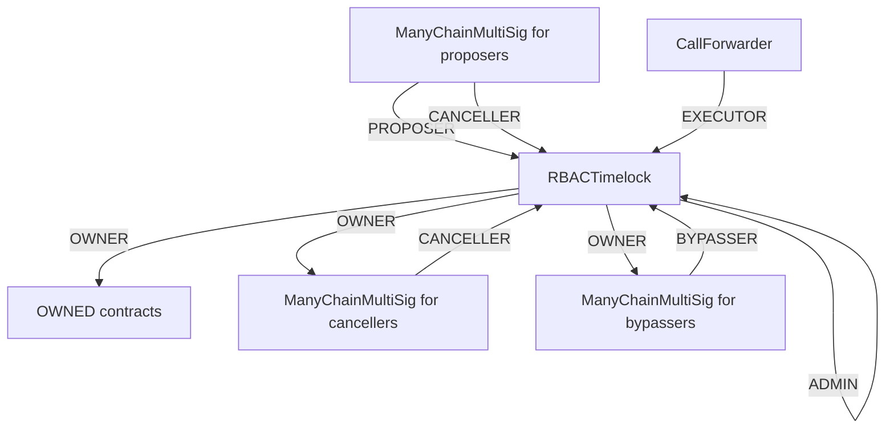
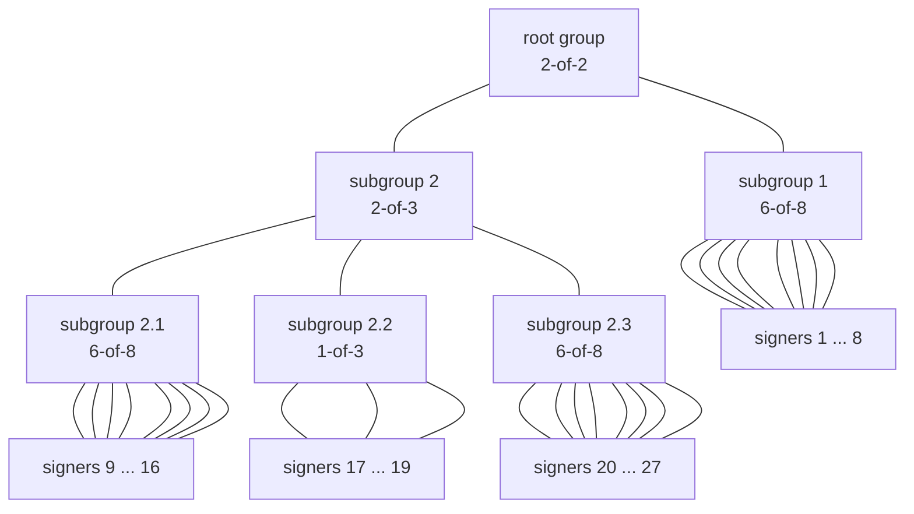
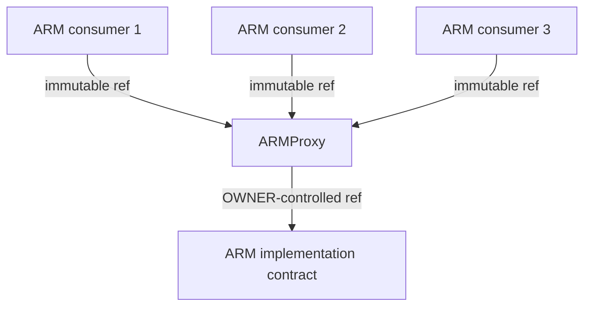

# Chainlink CCIP-2 audit details
- Total Prize Pool: $47,900 USDC 
  - HM awards: $25,500 USDC 
  - Analysis awards: $1,500 USDC 
  - QA awards: $750 USDC 
  - Bot Race awards: $2,250 USDC 
  - Gas awards: $0 USDC 
  - Judge awards: $5,000 USDC 
  - Lookout awards: $2,400 USDC 
  - Scout awards: $500 USDC 
  - Mitigation Review: $10,000 USDC (*Opportunity goes to top 3 certified wardens based on placement in this audit.*)
- Join [C4 Discord](https://discord.gg/code4rena) to register
- Submit findings [using the C4 form](https://code4rena.com/contests/2023-07-chainlink-cross-chain-contract-administration-multi-signature-contract-timelock-and-call-proxies/submit)
- [Read our guidelines for more details](https://docs.code4rena.com/roles/wardens)
- Starts July 03, 2023 20:00 UTC 
- Ends July 10, 2023 20:00 UTC 

**IMPORTANT NOTE:** Prior to receiving payment from this audit you MUST become a [Certified Warden](https://code4rena.com/certified-contributor-application/)  (successfully complete KYC). This also applies to bot crews.  You do not have to complete this process before competing or submitting bugs. You must have started this process within 48 hours after the audit ends, i.e. **by July 12, 2023 at 20:00 UTC in order to receive payment.**

**Note for C4 wardens:** For this contest, gas optimizations are out of scope. The Polynomial team will not be awarding prize funds for gas-specific submissions.

## Automated Findings / Publicly Known Issues

Automated findings output for the audit can be found [here](add link to report) within 24 hours of audit opening.

*Note for C4 wardens: Anything included in the automated findings output is considered a publicly known issue and is ineligible for awards.*


# Overview

### `CallProxy`, `ManyChainMultiSig`, `RBACTimelock`
The `CallProxy`, `ManyChainMultiSig`, `RBACTimelock` contracts are all part of a system of `owner` contracts that is supposed to administer other contracts (henceforth referred to as `OWNED`). `OWNED` contracts represent any set of contracts that are (1) potentially deployed across chains and (2) have an `owner` role (e.g. using OpenZeppelin's `OwnableInterface`).

Here is a diagram of how we envision these contracts to be configured:



Regular administration of the `OWNED` contracts is expected to happen through
the `RBACTimelock`'s Proposer/Executor/Canceller roles. The Bypasser role is 
expected to only become active in "break-glass" type emergency scenarios where
waiting for `RBACTimelock.minDelay` would be harmful.

The Proposer and Canceller `ManyChainMultiSig` contracts are expected to be
configured with a group structure like this (exact k-of-n parameters might differ):
```
          ┌──────────┐
          │Root Group│
      ┌──►│  5-of-8  │◄─────────┐
      │   └──────────┘          │
      │         ▲               │
      │         │               │
 ┌────┴───┐ ┌───┴────┐     ┌────┴───┐
 │signer 1│ │signer 2│ ... │signer 8│
 └────────┘ └────────┘     └────────┘
```

The Bypasser `ManyChainMultiSig` contract is expected to be configured with a 
more complex group structure like this:


### `ARMProxy`

The `ARMProxy` enables an `owner` (using `RBACTimelock`) to "upgrade" an underlying
`ARM` contract. When the `owner` wants to upgrade, they call `ARMProxy.setARM(new ARM address)`.
We expect the `ARMProxy` to transparently pass through any function calls except those to
functions defined by `ARMProxy` and the contracts inherits from.

Deployments are expected to look like this:

Initially, the "ARM implementtation contract" will implement the `IARM` interface.
As time goes by, we may add more functions to the `IARM` interface. By using a fallback function and assembly, we are future-proof against such updates.


*Please provide some context about the code being audited, and identify any areas of specific concern in reviewing the code. (This is a good place to link to your docs, if you have them.)*

# Scope

*List all files in scope in the table below (along with hyperlinks) -- and feel free to add notes here to emphasize areas of focus.*

*For line of code counts, we recommend using [cloc](https://github.com/AlDanial/cloc).* 

| Contract | SLOC | Purpose | Libraries used |  
| ----------- | ----------- | ----------- | ----------- |
| [src/ARMProxy.sol](src/ARMProxy.sol) | 36 | ARM proxy contract | [`@openzeppelin/*`](https://openzeppelin.com/contracts/) |
| [src/CallProxy.sol](src/CallProxy.sol) | 17 | Call proxy contract callable by anyone | [`@openzeppelin/*`](https://openzeppelin.com/contracts/) |
| [src/ManyChainMultiSig.sol](src/CallProxy.sol) | 275 | Cross-chain multisig | [`@openzeppelin/*`](https://openzeppelin.com/contracts/) |
| [src/RBACTimelock.sol](src/RBACTimelock.sol) | 216 | Cross-chain multisig | [`@openzeppelin/*`](https://openzeppelin.com/contracts/) |

## Out of scope

Everything not listed above is out of scope.

# Additional Context

*Describe any novel or unique curve logic or mathematical models implemented in the contracts*

*Sponsor, please confirm/edit the information below.*

## Scoping Details 
```
- If you have a public code repo, please share it here:  
- How many contracts are in scope?:   
- Total SLoC for these contracts?:  
- How many external imports are there?:  
- How many separate interfaces and struct definitions are there for the contracts within scope?:  
- Does most of your code generally use composition or inheritance?:   
- How many external calls?:   
- What is the overall line coverage percentage provided by your tests?:  
- Is there a need to understand a separate part of the codebase / get context in order to audit this part of the protocol?:   
- Please describe required context:   
- Does it use an oracle?:  
- Does the token conform to the ERC20 standard?:  
- Are there any novel or unique curve logic or mathematical models?: 
- Does it use a timelock function?:  
- Is it an NFT?: 
- Does it have an AMM?:   
- Is it a fork of a popular project?:   
- Does it use rollups?:   
- Is it multi-chain?:  
- Does it use a side-chain?: 
```

# Tests

Our tests use foundry. They rely on some ffi code written in Go (see `testCommands/`).
`forge test --ffi` should do the trick.

*Provide every step required to build the project from a fresh git clone, as well as steps to run the tests with a gas report.* 

*Note: Many wardens run Slither as a first pass for testing.  Please document any known errors with no workaround.* 
